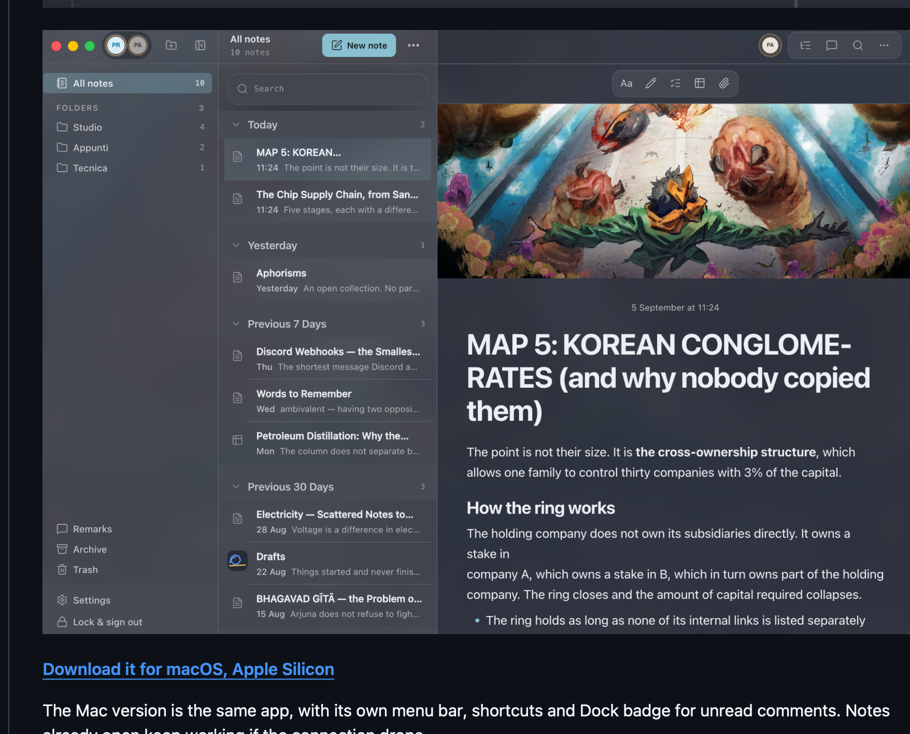
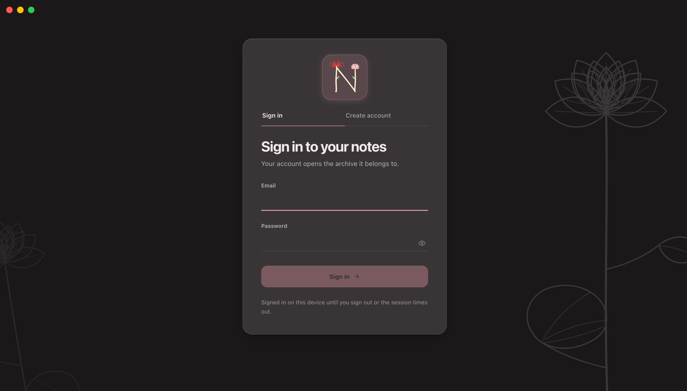
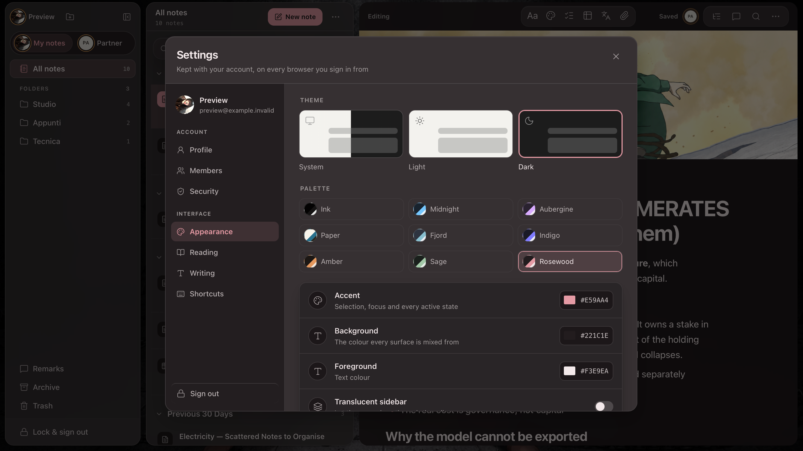

# note-sharing-app

A private place for your notes, shared with one other person if you want it.



## Why I built it

I wanted an ordinary notes app that did not slowly turn into a project-management
tool. Somewhere calm for quick lists and long writing alike, with just enough sharing
for two people who keep things together: partners, friends, siblings, whoever.

## What is in it

- A rich editor for writing, checklists, tables, links, images, PDFs and other files.
- Folders, pins, search, Archive and Trash so notes do not get lost as they pile up.
- Live editing when two people are in the same note, plus comments on a specific
  sentence or paragraph.
- Separate **My notes** and shared views inside one archive.
- Covers, avatars, themes and reading settings that each person can make their own.
- Markdown import and export, PDF text import, and local translation and proofreading
  tools.

It is for keeping notes, not for running a team. The useful collaboration is there
when you need it; the rest stays out of the way while you write.

## Get the app

Use it in the browser at <https://jacopo792.github.io/note-sharing-app/>: there is
nothing to install and it is always up to date. If you would rather have it in its own
window, there is a desktop app too.



**[Download it for macOS, Apple Silicon](https://github.com/Jacopo792/note-sharing-app/releases/latest)**

The Mac version is the same app, with its own menu bar, shortcuts and Dock badge for
unread comments. Notes already open keep working if the connection drops.

The first launch needs one extra step, because the app is not signed with an
Apple Developer ID. Open it, let macOS refuse, then go to System Settings →
Privacy & Security and press **Open Anyway**; on macOS 14 and earlier,
Control-click the app in Applications and choose **Open**. Once only.

Intel Macs and Windows have their own file on the same release page.
[`DESKTOP.md`](DESKTOP.md) has installation help and the practical details.

## Make it yours



Start with a ready-made palette or choose your own colours, theme and wallpaper. You
can also change the reading width, text size, line spacing and weight until longer
notes feel right. Your settings stay on your device, so the person sharing the archive
does not have to look at it the way you do.

## Accounts and shared archives

Everyone has their own account. On first sign-in, you get a private archive; to share
one, send an invitation from **Settings → Members**. It works for two people by
default, and invitations expire after seven days.

Both members can read and edit the shared archive. If a note needs to stay yours, you
can lock the whole thing or just a passage. Accounts outside the archive cannot see its
notes or files.

## Running it locally

Everything below is for working on the app rather than using it.

```bash
cp .env.example .env.local
pnpm install
pnpm dev            # in a browser
pnpm dev:desktop    # in its own window
```

`.env.local` needs these public browser values:

```dotenv
VITE_SUPABASE_URL=
VITE_SUPABASE_PUBLISHABLE_KEY=
VITE_COLLAB_URL=ws://127.0.0.1:8080
# Only the desktop build needs this one: where an invitation link has to point,
# since the link is opened on a machine that may not have the app.
VITE_WEB_ORIGIN=https://jacopo792.github.io/note-sharing-app/
```

Run the collaboration server separately:

```bash
SUPABASE_URL=... SUPABASE_SERVICE_ROLE_KEY=... pnpm --filter @notes-app/collab-server start
```

`SUPABASE_SERVICE_ROLE_KEY` belongs only on the server. Access to an archive is checked
against the signed-in user's membership.

### Preview without Supabase

```bash
pnpm preview:ui
```

This starts the full interface with in-memory demo data at
<http://localhost:5199>. You can sign in with any credentials.

## Checks

```bash
pnpm format:check
pnpm lint
pnpm typecheck
pnpm test
pnpm test:server
VITE_BASE_PATH=/note-sharing-app/ pnpm build
```

## How it is built

- **Frontend:** React 19, TanStack Router, Vite and Tailwind CSS.
- **Editor:** Tiptap with Yjs documents for the title and body.
- **Collaboration:** Hocuspocus over WebSocket, with Redis/Valkey when more than one
  server instance is running.
- **Backend:** Supabase Auth, Postgres, Row Level Security, Realtime and private
  Storage.
- **Offline support:** IndexedDB keeps an already authorised open document usable
  during a disconnect and syncs it after reconnecting.

The repository is a pnpm workspace of two packages and two shells:

- `packages/core/` is the application. Both shells mount it and neither may
  fork it – `eslint.config.js` forbids the core from importing a shell, and
  `packages/core/src/platform.ts` is the six-member interface each shell
  answers instead.
- `apps/web/` is the browser build, published to GitHub Pages.
- `apps/desktop/` is the Electron window: `pnpm build:desktop` writes a macOS
  `.dmg` and a Windows `.exe` into `apps/desktop/release/`, and
  `.github/workflows/release.yml` builds both on a tag. See
  [Get it for your Mac](#get-it-for-your-mac). The renderer is served from
  `app://notes` rather than `file://`, because the collaboration server refuses
  a socket whose origin it does not know and a `file://` page sends none.

The main areas of the repository are:

- `packages/core/src/screens/Notes.tsx` for workspace and note metadata state.
- `packages/core/src/components/` for the sidebar, note list and workspace menus.
- `packages/core/src/features/editor/` for the editor, comments, imports, attachments and language
  tools.
- `packages/core/src/lib/` for sessions, Supabase access, presence, appearance and collaboration.
- `packages/collab-server/` for the Hocuspocus service, persistence and health checks.
- `supabase/migrations/` for the database schema and policies.

Notes are stored as Tiptap JSON with a plain-text projection for search and previews.
Markdown is supported as an import/export format, not as the editor's internal format.

## Deployment

The app runs at <https://jacopo792.github.io/note-sharing-app/>. There is no other
deployment.

The frontend is published through GitHub Pages after the frontend checks, local
Supabase integration tests, Redis tests and server image build pass. It needs the
repository variables `VITE_SUPABASE_URL`, `VITE_SUPABASE_PUBLISHABLE_KEY` and
`VITE_COLLAB_URL`.

Desktop installers are built on a tag, from a matrix of macOS and Windows
runners, because electron-builder cannot cross-compile them. Bump the version in
`apps/desktop/package.json` to match, then:

```bash
git tag v0.1.0
git push origin v0.1.0
```

The workflow publishes both installers to the repository's Releases.

The collaboration server runs separately on Render with Valkey. `render.yaml`
documents that service. Database migrations must be applied before deploying a client
that reads new columns, while destructive schema changes must wait until old clients
no longer depend on them.

## Documentation

| File                           | Contents                                          |
| ------------------------------ | ------------------------------------------------- |
| [`PRODUCT.md`](PRODUCT.md)     | Product scope and behaviour                       |
| [`DESKTOP.md`](DESKTOP.md)     | The downloadable app: install and troubleshooting |
| [`DESIGN.md`](DESIGN.md)       | Interface rules and design decisions              |
| [`CLAUDE.md`](CLAUDE.md)       | Repository, deployment and migration notes        |
| [`SECURITY.md`](SECURITY.md)   | Security model and vulnerability reporting        |
| [`CHANGELOG.md`](CHANGELOG.md) | User-visible and security-relevant changes        |

## Licence

This project is licensed under the GNU General Public License, version 3 or later. See
[`LICENSE`](LICENSE).
