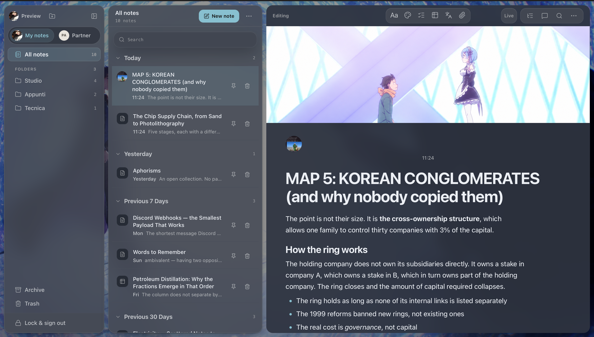

# note-sharing-app

A private notes app built around one shared archive.



## Why I built it

I wanted the simplicity of a normal notes app without the usual wall of features.
Most note-taking tools eventually turn into project-management suites; I just wanted
a calm place to write, with a few genuinely useful things to do together with the
person sharing the archive.

The result is deliberately simple when you are writing and collaborative where it
matters. Each archive is limited to two people: friends, partners, siblings or any
other pair who want a shared place for their notes. It is not meant to be a workspace
for teams.

## What we can do together

- Write in the same note in real time, with live cursors and optional presence.
- Comment on specific parts of a note and keep replies in one thread.
- Switch between **My notes** and the other person's notes while staying in the same
  archive.
- Organise notes with nested folders, pins, search, Archive and Trash.
- Add covers, images, links, tables, checklists, PDFs and other attachments.
- Import and export Markdown, or bring the text of a PDF into a note.
- Use local translation and proofreading tools without sending the text to an AI
  service.

The editor is made for long notes as well as quick ones. It uses Tiptap for rich text
and Yjs/Hocuspocus for live editing. Supabase handles accounts, the shared database and
private files.

## Make it yours

The app is highly customisable, and each person can set it up independently. You can
start from a ready-made palette or choose the accent, background and text colours
yourself; switch between light, dark and system themes; adjust contrast and sidebar
transparency; or use your own wallpaper with separate dim, blur and fit controls.

Reading has its own presets and controls for text size, line width, font weight and
line spacing. Profiles, avatars, note pictures, covers and live-caret colours add the
last personal touches. Most interface and reading settings stay on your device, so the
other person does not have to use the same setup.

## Running it locally

```bash
cp .env.example .env.local
pnpm install
pnpm dev
```

`.env.local` needs these public browser values:

```dotenv
VITE_SUPABASE_URL=
VITE_SUPABASE_PUBLISHABLE_KEY=
VITE_COLLAB_URL=ws://127.0.0.1:8080
```

Run the collaboration server separately:

```bash
SUPABASE_URL=... SUPABASE_SERVICE_ROLE_KEY=... pnpm --filter @notes-app/collab-server start
```

`SUPABASE_SERVICE_ROLE_KEY` belongs only on the server. Access to an archive is checked
against the signed-in user's membership.

### Preview without Supabase

```bash
pnpm preview:ui
```

This starts the full interface with in-memory demo data at
<http://localhost:5199>. You can sign in with any credentials.

## Checks

```bash
pnpm format:check
pnpm lint
pnpm typecheck
pnpm test
pnpm test:server
VITE_BASE_PATH=/note-sharing-app/ pnpm build
```

## How it is built

- **Frontend:** React 19, TanStack Router, Vite and Tailwind CSS.
- **Editor:** Tiptap with Yjs documents for the title and body.
- **Collaboration:** Hocuspocus over WebSocket, with Redis/Valkey when more than one
  server instance is running.
- **Backend:** Supabase Auth, Postgres, Row Level Security, Realtime and private
  Storage.
- **Offline support:** IndexedDB keeps an already authorised open document usable
  during a disconnect and syncs it after reconnecting.

The main areas of the repository are:

- `src/routes/notes.tsx` for workspace and note metadata state.
- `src/components/` for the sidebar, note list and workspace menus.
- `src/features/editor/` for the editor, comments, imports, attachments and language
  tools.
- `src/lib/` for sessions, Supabase access, presence, appearance and collaboration.
- `server/` for the Hocuspocus service, persistence and health checks.
- `supabase/migrations/` for the database schema and policies.

Notes are stored as Tiptap JSON with a plain-text projection for search and previews.
Markdown is supported as an import/export format, not as the editor's internal format.

## Accounts and shared archives

Each person signs in with a separate account. Membership in `archive_members` is the
access boundary: being a Supabase user by itself does not grant access to somebody
else's archive.

New users receive a personal archive on first sign-in. To share an existing archive,
an editor creates a one-time invitation from **Settings → Members**. Invitations expire
after seven days and can only be claimed by the invited address.

Members can read the archive. Editors can also change notes, folders, files, roles and
invitations. `owner_id` only decides where a note appears in the interface; it is not a
security boundary.

## Documentation

| File                           | Contents                                   |
| ------------------------------ | ------------------------------------------ |
| [`PRODUCT.md`](PRODUCT.md)     | Product scope and behaviour                |
| [`DESIGN.md`](DESIGN.md)       | Interface rules and design decisions       |
| [`CLAUDE.md`](CLAUDE.md)       | Repository, deployment and migration notes |
| [`SECURITY.md`](SECURITY.md)   | Security model and vulnerability reporting |
| [`CHANGELOG.md`](CHANGELOG.md) | User-visible and security-relevant changes |

## Deployment

The frontend is published through GitHub Pages after the frontend checks, local
Supabase integration tests, Redis tests and server image build pass. It needs the
repository variables `VITE_SUPABASE_URL`, `VITE_SUPABASE_PUBLISHABLE_KEY` and
`VITE_COLLAB_URL`.

The collaboration server runs separately on Render with Valkey. `render.yaml`
documents that service. Database migrations must be applied before deploying a client
that reads new columns, while destructive schema changes must wait until old clients
no longer depend on them.

## Licence

This project is licensed under the GNU General Public License, version 3 or later. See
[`LICENSE`](LICENSE).
